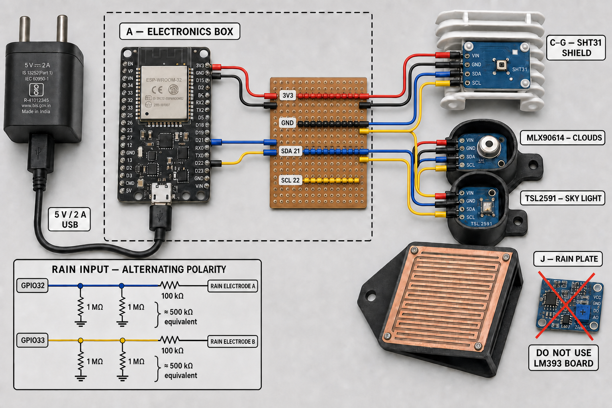
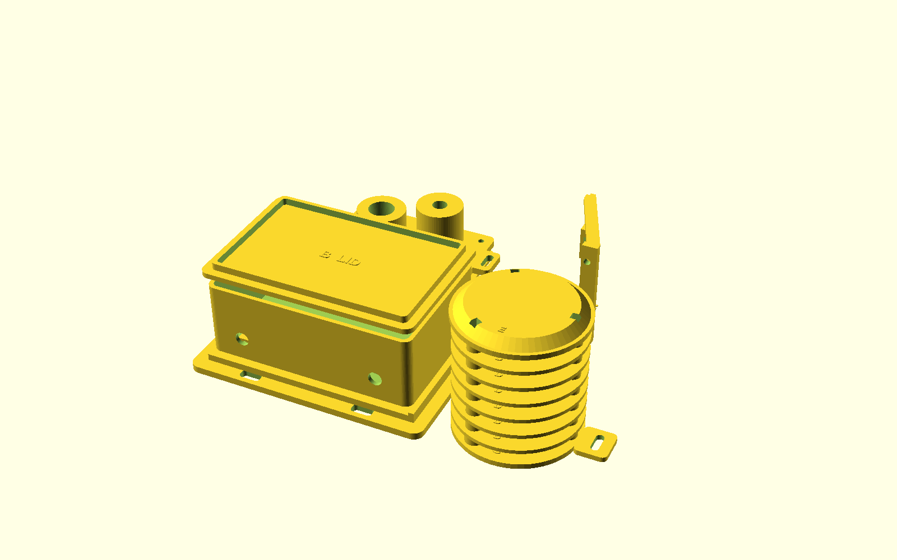
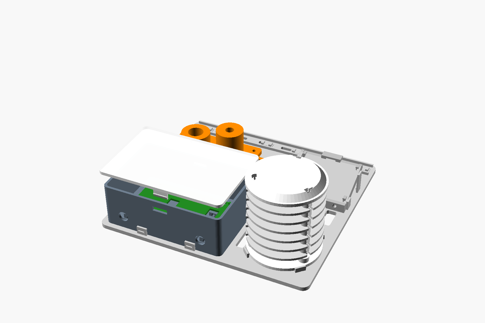

# AstroWeather India

An affordable, Wi-Fi-connected and almost entirely 3D-printable weather station
for attended astrophotography. It measures temperature, humidity, dew risk,
thermal cloud cover, relative sky brightness and rain, then presents a simple
imaging advisory through an ESP32 web dashboard and JSON API.

[](LICENSE)
[](https://github.com/pulikantitarun/astro-weather-india/actions/workflows/validate.yml)

> **Safety:** This is an attended-imaging aid, not a certified weather safety
> controller. Never use the low-cost rain plate as the sole input for an
> unattended observatory roof.



## Capabilities

- SHT31 ambient temperature and relative humidity
- calculated dew point and dew margin
- MLX90614 infrared zenith temperature
- locally calibrated cloud percentage and clarity score
- TSL2591 lux, full-spectrum, infrared and visible counts
- calibrated estimated SQM in mag/arcsec²
- heuristic estimated Bortle class, clearly labelled as an estimate
- low-duty-cycle, alternating-polarity rain detection
- ten-minute unsafe rain latch
- configurable `OK` / `UNSAFE` imaging advisory
- live phone/desktop web dashboard, refreshed every ten seconds
- authenticated web configuration for Wi-Fi, Telegram and weather thresholds
- optional Telegram reports every 30 or 60 minutes
- immediate Telegram rain, unsafe and recovery notifications
- JSON API at `/api/weather`
- direct ASCOM Alpaca ObservingConditions and SafetyMonitor devices
- native INDI Weather driver for KStars/Ekos-compatible installations
- sensor health flags and uptime
- normal Wi-Fi client mode with setup access-point fallback
- support-free printable parts labelled A-L
- editable OpenSCAD source and validated STL files
- designed for Creality K1C and all K2 build volumes

The clarity score is a calibrated **thermal cloud score**. It does not measure
seeing, atmospheric turbulence, aerosol optical depth, transparency or star
FWHM. The SQM value remains unavailable until the exact TSL2591 and optical head
are calibrated against a reference meter. Bortle is a visual scale, so its
dashboard value is always a heuristic estimate.

## Approximate India build cost

These are approximate July 2026 India reference prices before delivery charges.
Choose compatible modules from a supplier you trust.

| Group | Cost |
|---|---:|
| ESP32, MLX90614, rain sensor, wiring, solder, flux and power supply | ₹1,550.00 |
| SHT31 module | ₹312.70 |
| TSL2591 module | ₹755.00 |
| Electronics and assembly supplies subtotal | **₹2,617.70** |
| Approximately 250 g PETG | ₹200.00 |
| Reusable mounting straps | ₹50.00 |
| Estimated complete build | **₹2,867.70** |

Round-budget **₹2,900 plus shipping**. A soldering iron and ordinary hand tools
are not included. Optional conformal coating adds approximately ₹250.

See [`docs/BOM_India.csv`](docs/BOM_India.csv) for the complete itemized list.

## Printed assembly



An optional non-cellular snap-fit and cable-management v3 is available in
`stl_snapfit_v3/`. It adds a releasable lid, sky-head detents, split cable
grommets, internal strain relief and an extended mounting plate with a cable
spine. Print its six-piece L3 calibration kit before the full set. See
[`docs/SNAPFIT_V3.md`](docs/SNAPFIT_V3.md).

The newer optional tool-less v4 set is in `stl_toolless_v4/`. It adds lateral
snap-on shield louvers, click-in rods and roof, an SHT31 sled detent, PCB
retaining fingers, a compliant rain cradle, a snap electronics carrier and a
click-in mounting plate. Print its ten-piece L4 kit first and follow
[`docs/TOOLLESS_V4.md`](docs/TOOLLESS_V4.md).
Its physical surfaces are intentionally unmarked; identification uses the STL
filenames and assembly images.


V5 adds a single clean 210 x 200 mm tool-less backplane for every printed
subassembly and the complete cable loom. The sky head, radiation shield, rain
cradle and enclosure remain individually serviceable. See
[`docs/UNIFIED_V5.md`](docs/UNIFIED_V5.md) and print its twelve-piece L5 fit kit
before the full plate.

> **V5.1 correction:** Do not print the original V5 A5, K5 or L5 files from
> commit `88b9ef8`. The carrier pegs were connected but too short to retain O5,
> and the post-export audit found dock interference, unsupported rain-cradle
> regions, a mounting-slot clash and cable guides that did not retain the loom.
> Commit `73a9ac6` replaces those files with supported carrier posts, verified
> dock clearances, integrated rain pedestals, a relocated slot and flexible
> cable-retaining jaws. Download or clone the latest branch and print L5 first.



1. Print `stl/L_Fit_Kit_4_PIECES_PRINT_FIRST.stl`.
2. Confirm both press-fit pairs before printing the full set.
3. Print the remaining files in their supplied orientation with supports off.
4. Measure clone sensor boards before printing H and I.
5. Follow [`docs/ASSEMBLY_GUIDE.md`](docs/ASSEMBLY_GUIDE.md).

Recommended baseline: PETG, 0.4 mm nozzle, 0.20 mm layers and four walls. Full
K1C/K2 settings are in
[`docs/PRINT_SETTINGS_K1C_K2.md`](docs/PRINT_SETTINGS_K1C_K2.md).

## Electronics

All three digital sensors share the ESP32 I2C bus:

| ESP32 | Function |
|---|---|
| 3V3 | sensor power |
| GND | common ground |
| GPIO21 | SDA |
| GPIO22 | SCL |
| GPIO32 | rain electrode A network |
| GPIO33 | rain electrode B network |

Use only the exposed-trace rain plate, not its LM393 comparator board. The
complete pin map and rain resistor network are in
[`docs/WIRING.csv`](docs/WIRING.csv).

## Firmware

The firmware is provided for Arduino/PlatformIO.

```bash
cd firmware
copy AstroWeather_ESP32\secrets.example.h AstroWeather_ESP32\secrets.h
pio run
pio run --target upload
pio device monitor
```

You may edit `secrets.h` with initial Wi-Fi details, but v1.3 can be configured
entirely from its local web page. `secrets.h` is ignored by Git and must never
be committed.

If normal Wi-Fi connection fails after 20 seconds, the station creates:

- SSID: `AstroWeather-Setup`
- password: `astroclear`

The intended local hostname is `http://astroweather.local`.

On first setup, connect to the fallback network and open
`http://192.168.4.1/settings`. The default settings login is
`admin` / `astroadmin`. Change both the settings password and setup-access-point
password immediately. See
[`docs/WEB_CONFIGURATION.md`](docs/WEB_CONFIGURATION.md).

Telegram configuration, 30/60-minute reports and event notifications are
documented in [`docs/TELEGRAM.md`](docs/TELEGRAM.md). Telegram is outbound-only;
the station does not require router port forwarding.

### API fields

`GET /api/weather` returns:

- `air_c`, `humidity`, `dew_c`, `dew_margin_c`
- `sky_c`, `cloud_delta_c`, `cloud_percent`, `clarity_score`
- `lux`, `tsl_full`, `tsl_ir`, `tsl_visible`, `tsl_light_valid`
- `sqm_estimate`, `sqm_calibrated`, `bortle_estimate`
- `rain_raw`, `rain_detected`
- `sht_ok`, `mlx_ok`, `tsl_ok`
- `advisory_safe`, `uptime_s`, `firmware_version`
- `wifi_connected`, `wifi_rssi_dbm`
- `telegram_enabled`, `telegram_report_minutes`

`GET /health` verifies that the HTTP server is responding. Sensor health is
reported separately in the weather JSON.

### ASCOM and INDI

Firmware v1.2 advertises standard ASCOM Alpaca devices directly from the ESP32
on the local network. It exposes observing conditions and the combined safety
advisory without requiring a separate Windows driver executable. See
[`docs/ASCOM_ALPACA.md`](docs/ASCOM_ALPACA.md).

The native INDI Weather driver in `integrations/indi-astroweather` connects
KStars/Ekos, Astroberry, StellarMate and other user-installable INDI systems to
the same station. See [`docs/INDI.md`](docs/INDI.md). Standard ASIAIR firmware
does not support arbitrary third-party driver installation and is not claimed
as compatible.

## Calibration

Local calibration is essential:

1. compare the shaded SHT31 against a trustworthy reference;
2. collect MLX90614 data on at least three clear and three overcast nights;
3. enter the local clear/overcast thermal deltas in the firmware;
4. calculate `SQM_CAL_OFFSET` from paired reference-SQM readings;
5. calibrate dry and droplet readings for the rain threshold;
6. validate the advisory through several supervised imaging sessions.

See [`docs/CALIBRATION.md`](docs/CALIBRATION.md).
The measurement basis is documented in
[`docs/REFERENCES.md`](docs/REFERENCES.md).

## Repository layout

- `assets/` — assembly visuals
- `cad/` — editable OpenSCAD source
- `docs/` — BOM, wiring, printing, assembly, calibration and software setup
- `firmware/` — ESP32 source and PlatformIO configuration
- `integrations/` — native INDI driver (ASCOM Alpaca is built into firmware)
- `stl/` — print-ready meshes
- `tools/` — STL, SQM and integration validation utilities

## Licence

Copyright © 2026 Tarun and contributors.

This project—including firmware, CAD, printable models, documentation and
visuals—is licensed under the
[GNU Affero General Public License v3.0 or later](LICENSE). If you modify and
operate a network-accessible version, the AGPL requires the corresponding source
to be offered to its users. Derivative distributions must preserve the same
licence obligations.
