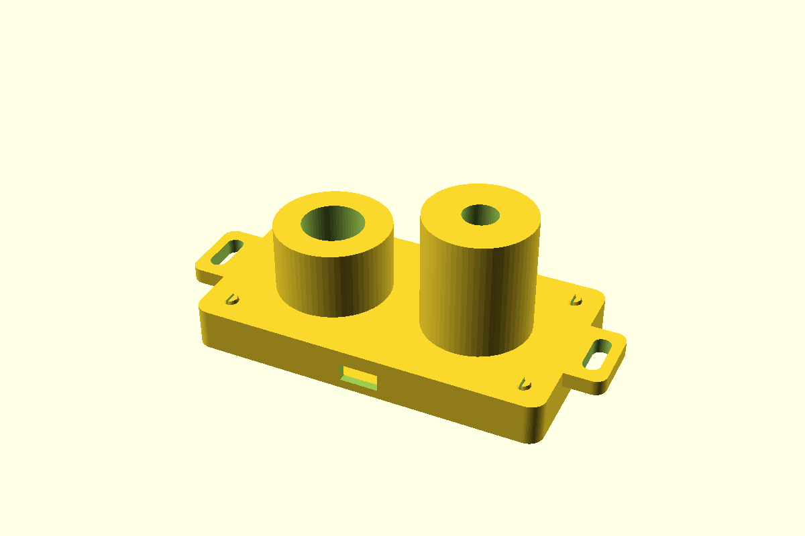

# AstroWeather India — Non-Cellular V5.2

The current non-cellular edition of an affordable, Wi-Fi-connected and almost
entirely 3D-printable weather station for attended astrophotography.

[](LICENSE)
[](https://github.com/pulikantitarun/astro-weather-india/actions/workflows/validate.yml)

> **Safety:** This is an attended-imaging aid, not a certified weather-safety
> controller. Never use the inexpensive rain plate as the sole input for an
> unattended observatory roof.


## Current printable version

The only current printable set is [`stl_unified_v5/`](stl_unified_v5/).

- `K5_Single_Unified_Base_Plate.stl` is one 210 × 200 mm backplane.
- All modules remain individually serviceable.
- The enclosure, lid, carrier, shield, sky head and rain cradle snap together.
- Six integrated jaws manage the rear cable loom.
- Physical surfaces are intentionally unmarked; filenames identify the parts.
- Print `L5_Fit_Kit_12_PIECES_PRINT_FIRST.stl` before the full build.

The original V5 export from commit `88b9ef8` must not be printed. V5.1 corrects
short carrier posts, dock interference, incomplete rain support, a mounting-slot
clash and open cable guides.

V5.2 also replaces H5, I5 and L5. In V5.1, H5's solid lower plate occupied the
same space as I5's PCB rails and snap fingers, so the sky-head halves could not
seat. V5.2 adds a raised protective rim, support pads, split snap pins and
matched 3.90 mm sockets.

Read the complete [V5.2 printing and assembly guide](docs/UNIFIED_V5.md).




## Capabilities

- SHT31 temperature and humidity
- calculated dew point and dew margin
- MLX90614 zenith temperature and calibrated thermal-cloud estimate
- TSL2591 relative sky brightness
- reference-calibrated estimated SQM and heuristic Bortle class
- alternating-polarity rain sensing with a ten-minute unsafe latch
- configurable `OK` / `UNSAFE` imaging advisory
- responsive local web dashboard and authenticated settings page
- Wi-Fi setup-access-point fallback
- Telegram reports every 30 or 60 minutes plus rain/safety alerts
- JSON weather API
- ASCOM Alpaca ObservingConditions and SafetyMonitor
- native INDI Weather driver

The clarity score is a calibrated thermal-cloud score. It does not measure
seeing, turbulence, aerosols, transparency or stellar FWHM. SQM must be
calibrated against a reference meter; Bortle remains a heuristic estimate.

## Electronics

All digital sensors share the ESP32 I²C bus:

| ESP32 | Function |
|---|---|
| 3V3 | sensor power |
| GND | common ground |
| GPIO21 | SDA |
| GPIO22 | SCL |
| GPIO32 | rain electrode A network |
| GPIO33 | rain electrode B network |

Use the exposed-trace rain plate without its LM393 comparator board. See
[`docs/WIRING.csv`](docs/WIRING.csv), [`docs/BOM_India.csv`](docs/BOM_India.csv)
and [`docs/ASSEMBLY_GUIDE.md`](docs/ASSEMBLY_GUIDE.md).

## Firmware

```powershell
cd firmware
copy AstroWeather_ESP32\secrets.example.h AstroWeather_ESP32\secrets.h
python -m platformio run
python -m platformio run --target upload
```

If Wi-Fi is not configured, connect to `AstroWeather-Setup` and open
`http://192.168.4.1/settings`. Change the default administrator and setup
passwords immediately.

## Validation

All 15 current meshes pass watertightness, winding, component-count,
positive-volume, Z=0 and K1C/K2 build-envelope checks. Installed-state CGAL
intersections are empty for the carrier, enclosure dock, shield, sky head and
rain cradle. Firmware, configuration, SQM, ASCOM and INDI checks run in GitHub
Actions.

Digital checks do not prove PETG snap force, sensor-board clone dimensions,
weather sealing or field calibration. Approve the supplied fit kit and perform
staged attended testing.

## Source and licence

The editable entry point is
[`cad/AstroWeather_Unified_Base_v5.scad`](cad/AstroWeather_Unified_Base_v5.scad).
The other SCAD files in `cad/` are required source modules for that current
design, not separately supported printable editions.

Licensed under GNU AGPL-3.0-or-later.
