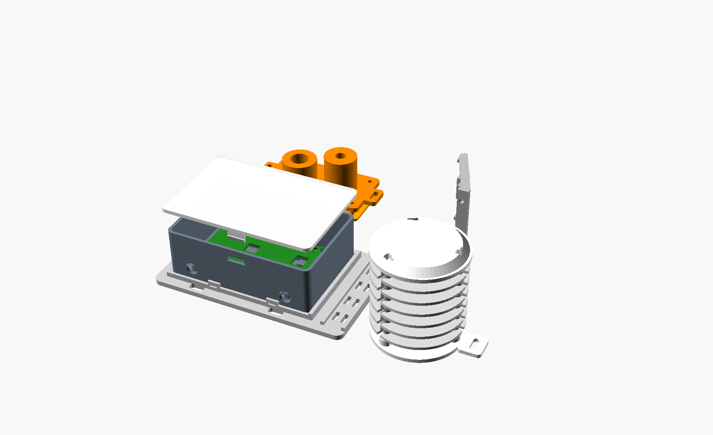
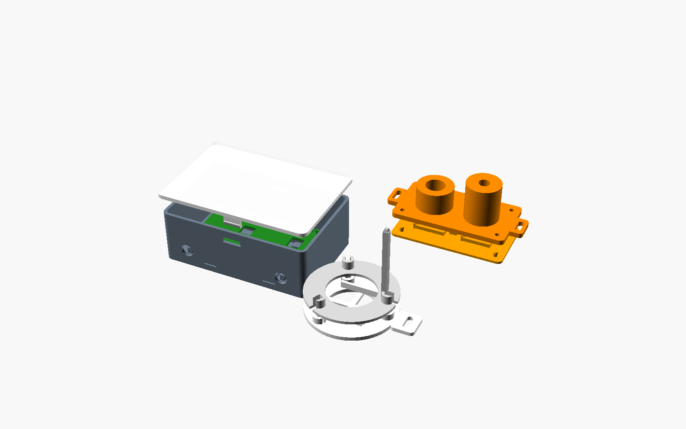

# Tool-less snap assembly revision 4

This optional non-cellular revision preserves the validated v2 and v3 files.
It adds a separate `stl_toolless_v4/` set intended to assemble without screws
or structural cable ties.

The v4 parts have clean, unmarked physical surfaces. There are no embossed
part IDs or function labels. Use the descriptive STL filenames and the images
in this guide to identify each component.

## What now clicks together

- A4 clicks into four releasable fingers on K4.
- O4 clicks onto four internal A4 studs and retains the nominal ESP32 and
  auxiliary board with compliant corner fingers.
- B4 keeps the two-sided push-to-release lid from v3.
- Three F4 rods click into C4.
- Each D4 louver pushes sideways onto all three rods; no threading is required.
- E4 clicks onto the tops of the three rods.
- G4 slides into C4 and clicks against the centre stop.
- The nominal MLX90614 and TSL2591 boards click into I4's flexible fingers.
- I4 clicks into H4 using the four proven sky-head detents.
- The common 55 x 40 mm bare rain plate clicks into J4's compliant cradle.
- M4 cable clips and N4 split grommets remain tool-less.

Cable ties through K4 and the internal strain-relief anchors are optional
outdoor safety retainers. They are not needed to hold the printed assembly.

## Print L4 before the full set

`L4_Fit_Kit_10_PIECES_PRINT_FIRST.stl` contains the lid window and tongue,
sky-head peg and socket, cable clip, split grommet, rod detent, lateral louver
socket, carrier peg and compliant carrier hole.

Use PETG, a 0.4 mm nozzle, 0.20 mm layers, four walls, five bottom layers,
20% gyroid, supports off and calibrated elephant-foot compensation.

Every test joint must click with finger pressure and release without pliers.
Cycle each interface ten times. Reject a test that whitens, cracks or needs
heavy force. Correct flow and elephant foot before altering clearances.

## Recommended assembly order

1. Print and approve L4.
2. Click O4 into A4, then press the electronics boards under O4's corner
   fingers. Route power and sensor cables through N4 grommets.
3. Press A4 into K4 until all four side tabs click. Push the K4 tabs outward
   to remove A4.
4. Fit B4 after wiring tests. Press both labelled A4 windows while lifting to
   remove it.
5. Click the three F4 rods into C4.
6. Push each D4 sideways onto the rods, one level at a time.
7. Slide G4 into C4 until its end tongue clicks.
8. Press E4 evenly onto all three rod ends.
9. Press the measured sky-sensor boards into I4, route the loom under its
   bridge, then click H4 onto I4.
10. Press the measured bare rain plate into J4 from the low end.
11. Snap the loom into M4 clips and leave a downward drip loop at every head.

## Print quantities

| STL | Quantity |
|---|---:|
| A4, B4, C4, E4, G4, H4, I4, J4, K4, O4 | 1 each |
| D4 side-snap louver | 6 |
| F4 detent rod | 3 |
| M4 cable clip | 6 |
| N4 split grommet | 2 |
| L4 calibration kit | 1 first; do not install its coupons |

## Release points

- B4: press both A4 `PUSH` windows.
- A4 from K4: flex the four K4 tabs outward a few millimetres.
- O4: support it and release one compliant stud hole at a time.
- D4: support the ring beside a rod and peel its slotted socket sideways.
- E4: lift evenly near all three rod sockets.
- G4: depress the centre tongue and slide the sled out.
- I4/H4: release one corner at a time; do not twist the sensor towers.
- PCBs: flex only the nearby retaining finger, then lift that board edge.

## Board compatibility limits

O4 targets an approximately 52 x 28 mm ESP32 development board plus an
approximately 20 x 34 mm auxiliary/perfboard. I4 targets nominal 22 x 18 mm
and 20 x 18 mm sensor pockets. J4 targets a 55 x 40 mm bare rain plate.

Measure delivered boards with callipers before the full print. Cheap clone
PCBs can differ in outline, connector position and component height. Edit the
named parameters in `AstroWeather_Toolless_Snap_v4.scad` if necessary. Never
force a mismatched PCB beneath a snap finger.

## Physical limits

Digital validation proves mesh integrity and nominal clearances. It cannot
prove snap force, fatigue life, UV life, weather sealing or a clone PCB fit.
Snap fits do not make the enclosure waterproof. Use PETG or ASA, downward cable
entries, drip loops, suitable sealant and a sheltered position. Do not use this
advisory station as the sole unattended roof-safety controller.
