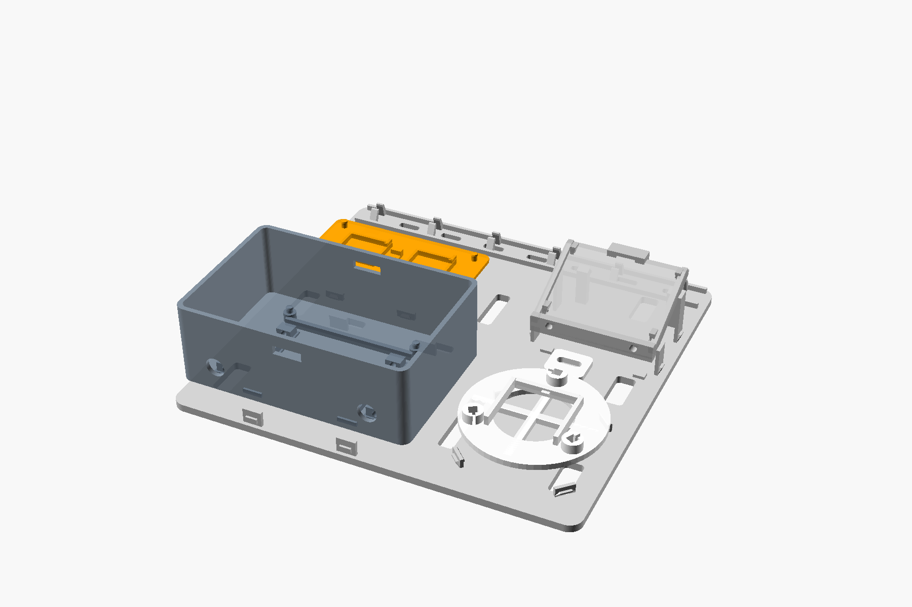

# V5 unified tool-less base

V5 keeps the clean, unmarked V4 snap parts and replaces the separate mounting
arrangement with one `K5_Single_Unified_Base_Plate.stl`.

## What the single plate holds

- A5 electronics enclosure on four push-out service tabs;
- C5 radiation shield in a four-finger circular nest;
- I5/H5 sky head in a four-clip rectangular nest;
- J5 rain cradle at its working slope on four integrated support pads;
- the complete loom in a rear channel with six snap-over bridges.

All sensor assemblies remain individually removable. K5 is the only mounting
backplane.

## V5.1 engineering corrections

The post-export assembly audit corrected the following before physical print:

- all four O5 carrier posts now support the carrier at Z=8.0 mm and project
  their retaining heads 1.0 mm above its 2 mm base;
- the four A5 dock arms no longer intersect the enclosure catch ledges;
- shield and rain-clip root gussets grow away from the captured parts;
- the rain cradle seats on connected front pads and two 6 mm-wide rear
  pedestals whose top plane matches the actual J5 convex-hull underside;
- the rear-right mounting slot was moved clear of its rain pedestal;
- the rear loom lane now uses flexible jaws with a 4.6 mm insertion throat.

Final CGAL installed-state intersections are empty for the carrier, A5 dock,
shield dock, sky dock and rain dock. Surface seating is tested separately from
positive-volume collision.

## Critical mounting orientation

K5 must remain approximately horizontal and level. The sky apertures must point
at the zenith and the rain plate must retain its designed upward slope.

Do not fasten K5 flat against a vertical wall or mast. Use a horizontal shelf,
mast-top tray or 90-degree metal/printed support bracket beneath it. The long
slots are for securing K5 to that horizontal support.

## Print L5 first

`L5_Fit_Kit_12_PIECES_PRINT_FIRST.stl` contains the ten V4 interface tests plus
an exact K5 edge clip and a 3 mm captured-edge coupon.

Use PETG, a 0.4 mm nozzle, 0.20 mm layers, four walls, five bottom layers,
20% gyroid and supports off. Every joint must click with finger pressure,
release without pliers, and survive ten cycles without whitening.

## Printing K5

K5 is 210 x 200 x 31.2 mm. It fits a 220 x 220 x 250 mm K1C bed with 5 mm
clearance on each X side and 10 mm on each Y side.

- Confirm the build plate is actually 220 x 220 mm and correctly centered.
- Use the supplied flat orientation.
- Do not use a wide external brim; it can exceed the K1C printable area.
- Use five walls, six bottom layers and 25% gyroid for the full backplane.
- PETG is preferred; ASA is better outdoors if the printer is configured for it.
- Clean the bed and verify first-layer calibration across the full area.
- The rain pedestals, cable jaws and small snap hooks print support-free.

## Assembly order

1. Approve all twelve L5 coupons.
2. Press O5 and the electronics into A5, then complete and bench-test wiring.
3. Press A5 into the front-left dock until all four base fingers click.
4. Assemble C5, three F5 rods, six D5 louvers, G5 and E5; press the completed
   shield into the circular dock one clip at a time.
5. Install the sky PCBs in I5, route their loom, click H5 onto I5, then press
   the completed sky head into the rear-left rectangular dock.
6. Rotate J5 from its print orientation into its working slope. Rest it on the
   four rear-right support pads and press each side lip beneath the tall clips.
7. Route all low-voltage wiring into the rear loom lane. Press it below each of
   the six bridges and leave drip/service loops before each sensor.
8. Fit N5 grommets and close B5 only after all live sensor tests pass.

## Removing a module

- A5: push its four K5 fingers outward while lifting the enclosure evenly.
- Shield: support C5 beside a clip and release opposite clips in pairs.
- Sky head: flex only the four low tray clips; never pull on the sensor towers.
- Rain cradle: support the sloped tray and release the low pair before the tall
  rear pair.
- Loom: peel one cable section sideways from each bridge; do not pull on a PCB.

## Print quantities

| STL | Quantity |
|---|---:|
| A5, B5, C5, E5, G5, H5, I5, J5, K5, O5 | 1 each |
| D5 louver | 6 |
| F5 rod | 3 |
| M5 cable clip | 6, only where the loom leaves K5 |
| N5 split grommet | 2 |
| L5 calibration kit | 1 first |

## Physical and outdoor limits

Mesh validation cannot prove snap force, clone-PCB compatibility, wind loading,
fatigue, UV life or weather sealing. K5 creates a larger wind-catching assembly
than the separate mounts. Use redundant UV-resistant safety ties after physical
testing if the station is exposed above people or equipment.

Snap fits do not waterproof A5. Keep cable entries downward, use drip loops and
suitable sealing, and place the electronics beneath shelter where possible.
This remains an advisory station, not the sole unattended roof-safety input.
